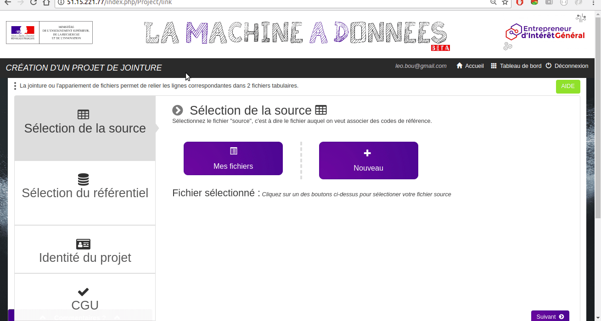
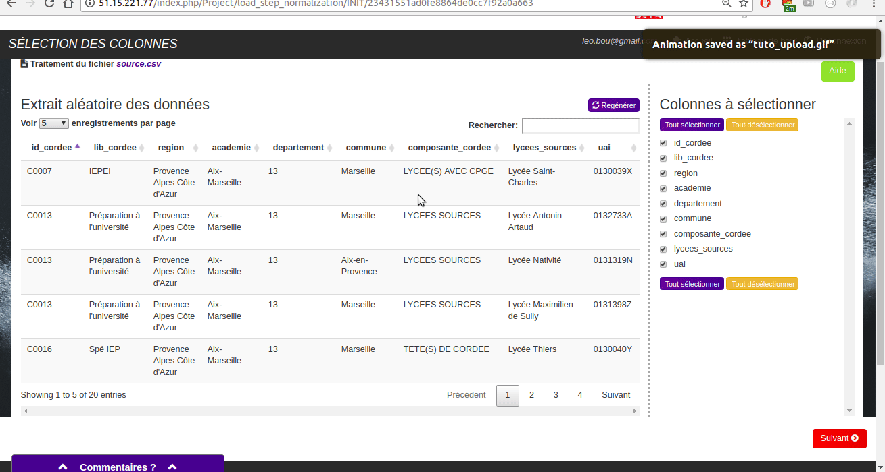
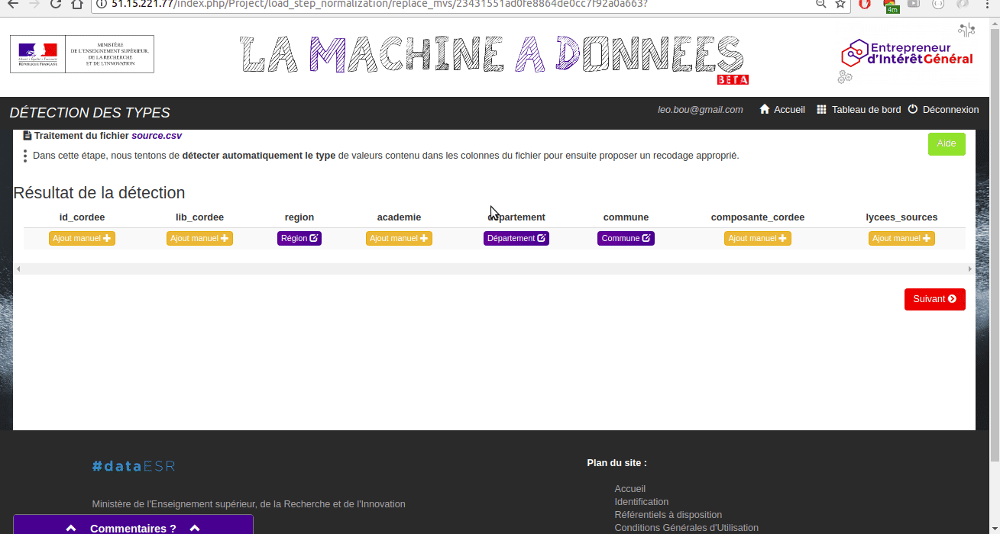
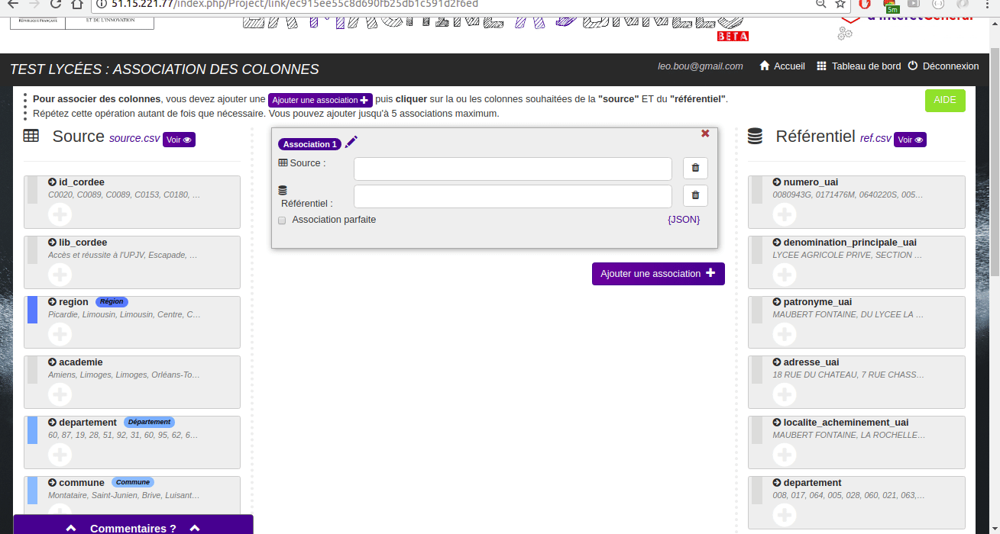
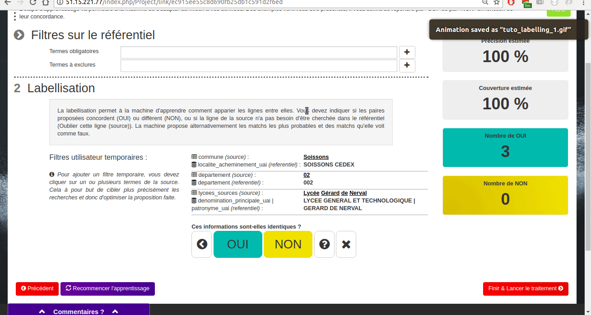
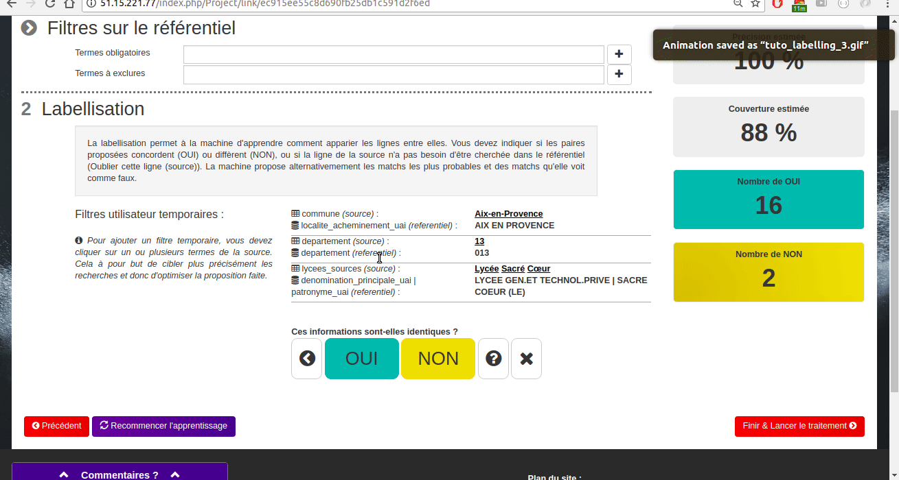
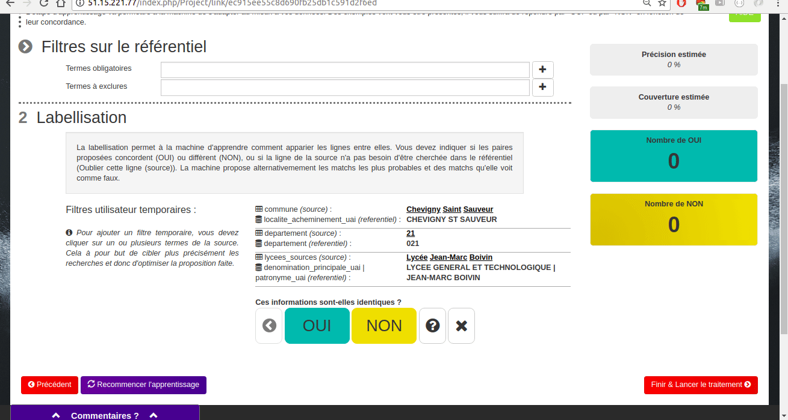

# Comment utiliser la machine à données

## Les fichiers de ce tutoriel:
La source contient des informations associées à des lycées: [source_tuto.csv]
La référence est une base de lycées avec leur identifiant unique UAI: [ref_tuto.csv]

### Upload des deux fichiers et création du projet:

### Sélection des colonnes:
Vérifier que le fichier a été correctement uploadé

### Inférence de types des colonnes:
Elle est optionnelle et peut être passée. Il est possible de corriger les types détectés par la machine.

### Appariement de colonnes:
Il faut grouper ensemble les colonnes censées correspondre. Dans le cas de ce fichier, il est intéressant de grouper les colonnes:

- `departement` avec `departement`
- `commune` avec `localite_acheminement_uai`
- `lycees_sources` avec `denomination_principale_uai` et `patronyme_uai` 

### Labellisation:
Il faut indiquer à la machine les paires qui sont ou ne sont pas des matchs pour qu’elle affine l’algo de matching en cliquant sur “oui” ou “non”. On peut utiliser le bouton “précédent“ pour revenir en arrière. On peut utiliser je ne sais pas quand le cas est ambigu.

On peut accélérer la labellisation (au début notamment), en indiquant directement les mots qui importants en cliquant dessus (tous les mots sélectionnés seront recherchés dans la table de référence).

Quand les performances semblent satisfaisantes (après au moins 5 labellisations), on peut passer à l’étape suivante.

Résultats:
On voit pour chaque ligne de la source la correspondance dans le référentiel qui a été trouvée par la machine (ou non). Le bouton vrai/faux permet d’indiquer si le match trouvé est effectivement bon. Certains matchs sont déjà à “faux” car la machine n’a pas une confiance suffisante dans le match proposés. Les matchs à “faux” ne seront pas présents dans le fichier final.

[tuto_resultats_1.gif]

On peut trier les résultats par confiance. Si les résultats ne sont pas satisfaisants on peut revenir à la labellisation ou même changer l’appariement de colonnes. Sinon, on peut télécharger le fichier avec les résultats du matching.

[tuto_resultats_2.gif]
